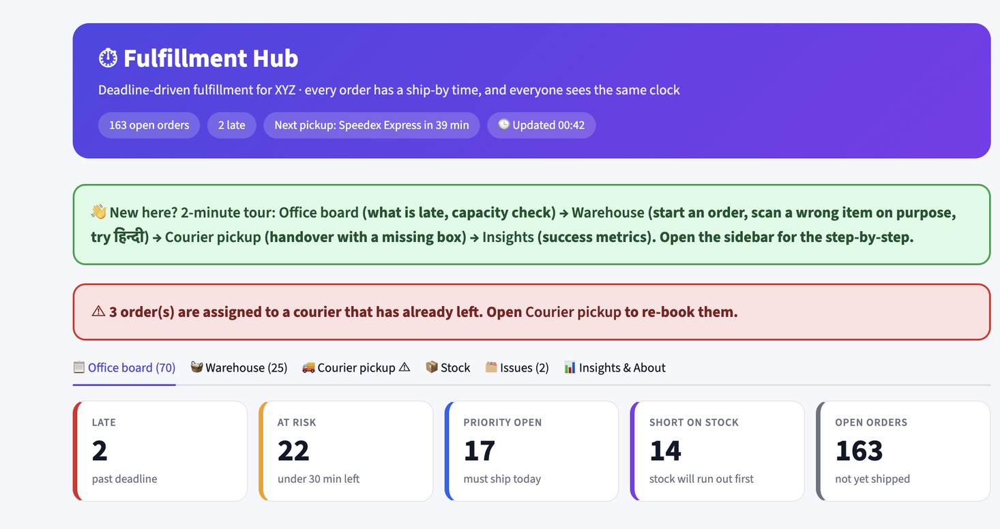
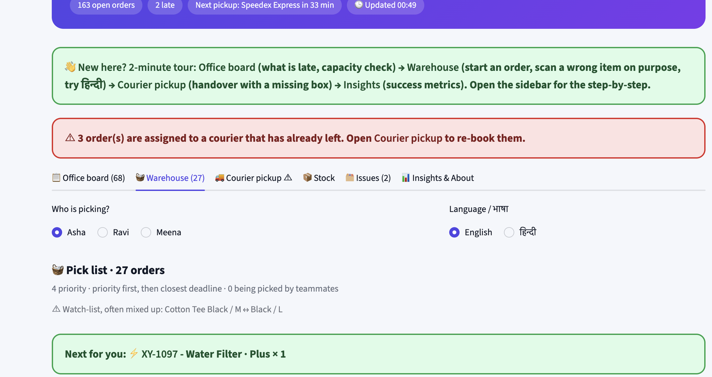
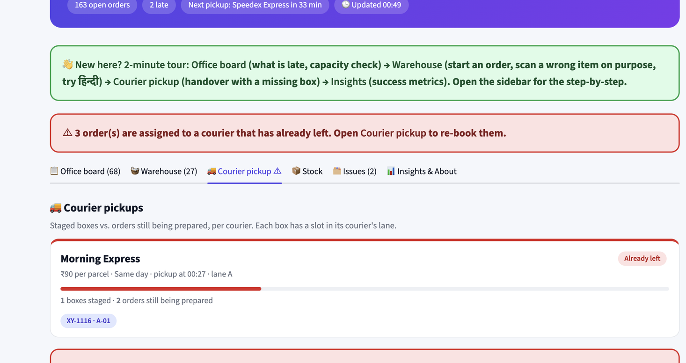
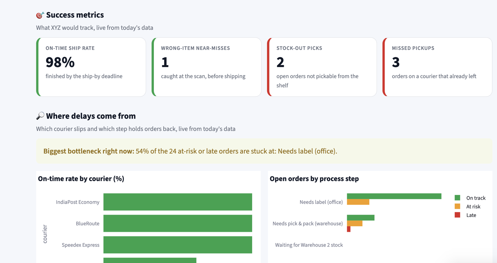

# ⏱ Fulfillment Hub: deadline-driven fulfillment

A fulfillment control room for **XYZ**, a small e-commerce business (200-300 orders/day). Built as the **Karmic Seed take-home project (Round 3)**. **All data is synthetic.**

**Code:** <https://github.com/kunika19-cgc/fulfillment-hub> · **Video walkthrough:** `<paste video link>` · **AI usage note:** [docs/AI_USAGE_NOTE.md](docs/AI_USAGE_NOTE.md)

> **The pitch:** XYZ's problem is not a lack of features, it is a lack of **visibility and time**. A spreadsheet says *what exists*, never *by when it must happen*. So every order gets a **ship-by deadline** (courier pickup minus a safety buffer), and the whole app is built around that clock.

## Screenshots

**Office board:** what is late, what is at risk, capacity per courier pickup.


**Warehouse:** one order at a time, big buttons, Hindi/English.


**Courier pickup:** staged boxes per courier, handover checklist, re-booking.


**Insights:** success metrics, courier on-time rate, orders by process step, biggest bottleneck.


## Diagnosis: two root causes behind all seven pains

1. **No single source of truth.** Stock, status and issues live in different places, so nobody sees the same picture.
2. **No concept of time.** Nothing says "do this by 14:10", so delays and missed priority orders go unnoticed until the courier has left.

## What I built, and what I left out

| Level | Feature | Why |
|---|---|---|
| **Deep** | Deadline queue, delay alerts, priority always on top | The base of everything; priority misses start here |
| **Deep** | Scan-to-verify (wrong item / variant) | A wrong parcel costs a return, a refund and a rating |
| **Deep** | Stock reservation, auto transfer from Warehouse 2, "item not found" | Pickers lose time and orders get stuck |
| **Simple** | Staging lanes + courier handover checklist | Last-step failures; cheap to fix |
| **Simple** | Issue log (auto-filled) | Ends informal handling |
| **Differentiator** | **Capacity check** per courier pickup | Catches a delay *before* it happens |
| **Differentiator** | **Confusable SKUs** learned from mistakes | Prevention instead of just detection |
| **Differentiator** | **Where delays come from** (Insights): courier on-time rate, stuck-at-which-step, biggest bottleneck | Tells the office *what to fix first*, not just that something is late |
| **Not built** | Real courier/marketplace APIs, payments, logins, trend analytics over time | The focus is the workflow, not integrations |

## Quick start (run it locally in 2 minutes)

**You need:** Python 3.10 or newer ([python.org](https://www.python.org/downloads/)). No external database, no API keys, no internet needed after install.

**macOS / Linux**

```
git clone https://github.com/kunika19-cgc/fulfillment-hub.git
cd fulfillment-hub
python3 -m venv venv
source venv/bin/activate
pip install -r requirements.txt
streamlit run app.py
```

**Windows (PowerShell)**

```
git clone https://github.com/kunika19-cgc/fulfillment-hub.git
cd fulfillment-hub
py -m venv venv
venv\Scripts\Activate.ps1
pip install -r requirements.txt
streamlit run app.py
```

The app opens at **<http://localhost:8501>**. If the browser does not open by itself, paste that address into it.

**See the shared data live:** open the app in two browser windows (one as the office, one as the warehouse). Create a label in one, press **Refresh** in the other: the order is in the Warehouse tab.

**First 2 minutes** (also in the app's sidebar): on **Office board** create a label for the top priority order. Open **Warehouse**, pick your name, press **Start next order**, then scan a *wrong* barcode on purpose (the demo helper under the scan box lists the barcodes), then the right one, and pack it. Open **Courier pickup** to re-book the orders stuck on the courier that already left, **Issues** to see the near-miss logged automatically, and **Insights** for the success metrics and the biggest bottleneck. **Reset demo for everyone** in the sidebar starts over.

**Run the tests:** `pip install -r requirements-dev.txt` then `pytest -q` (55 tests: business rules, the shared database, Hindi/English, and the screen workflows).

**If something goes wrong**

- *`No module named ...`*: the virtual environment is not active. Re-run the `activate` line, then `pip install -r requirements.txt`.
- *Port already in use*: run `streamlit run app.py --server.port 8502`.
- *Data looks odd or stale*: press **Reset demo for everyone** in the sidebar (or delete `hub_state.db`).

## The three differentiators

- **Capacity check (Office board).** For each courier pickup: *open orders × 4 min ÷ workers on shift* against the minutes left before the ship-by deadline. If the team cannot make it, the card says so before it happens: *"Speedex 19:33: 8-order gap. Add a worker (needs 5, you have 3), or shift to BlueRoute."* Change **Workers on shift** and watch the gap close.
- **Confusable SKUs (Warehouse).** Every wrong scan is remembered. When two look-alike variants are mixed up **2 or more times**, the system marks them confusable: from then on the packer sees an extra-large red card ("✔ Black / M ✖ Black / L, read the label twice") and the pair appears on the warehouse watch-list. The demo starts with Cotton Tee Black/M vs Black/L already flagged, and it learns new pairs live.
- **Where delays come from (Insights).** Three read-only views, all computed live in `logic.py`: the **on-time rate per courier** (which pickup keeps slipping), **open orders by process step** (needs label / needs pick & pack / waiting for Warehouse 2 stock / item not found, each split into on track, at risk, late), and one plain sentence naming the **biggest bottleneck right now**, for example *"62% of the 24 at-risk or late orders are stuck at: Needs label (office)."* It turns "orders are late" into "fix this step first".

## Built for a team that is not tech-savvy

- **One screen, one job.** The warehouse screen shows one order at a time with big buttons. "Start next order" always hands out the most urgent order a picker can actually pick.
- **Hindi / English toggle** on the warehouse screen, in plain sentences: *"यह Black / L है, आपको Black / M चाहिए."*
- **Pick your name instead of a login.** Each order is held by one worker, so two people never pick the same order.
- **Never stuck.** If stock is only in Warehouse 2, a **transfer task is created automatically**, the order becomes *Waiting for Transfer*, and the picker is moved to the next order. If an item is **not on the shelf**, the stock is flagged, the order goes on hold as an Issue, the office gets an alert, and the picker moves on.

## Workflow

`New → Label ready → (Waiting for transfer / On hold) → Packed & staged → Handed over`, and an issue can be raised at any step.

- **Ship-by deadline = courier pickup − 20 min** buffer (`SLA_BUFFER_MIN` in `logic.py`). Colours: 🟢 on track, 🟠 less than 30 min left, 🔴 late.
- **Priority orders** get the fastest courier that can still be caught today, and always sort first.
- **Packer check:** scan the item, a mismatch is a big red warning and is logged; "Packed" only works after the scan, the count and the label check.
- **Staging:** each courier has a lane with named slots. **Handover:** expected vs. staged count, a missing box is shown right away.

## Who uses what

- **Office (laptop):** Office board - KPIs, alerts, capacity check, courier suggestion, CSV import.
- **Warehouse (phone/tablet):** Warehouse tab - pick, scan, pack in 3 steps.
- **Courier desk:** Courier pickup - staged boxes per courier, handover checklist, re-booking.
- **Manager / analyst:** Insights - success metrics, courier on-time rate, bottleneck by process step.
- **Everyone** shares the same data (SQLite), and problems land in the Issues tab automatically.

## Success metrics (what XYZ would track)

On-time ship rate · wrong-item near-misses caught · stock-out picks · missed pickups. All four are shown **live in the Insights tab**, followed by the "Where delays come from" views.

## Assumptions (all tunable in `logic.py`)

One order = one courier · ship-by buffer 20 min · capacity uses 4 min of hands-on time per order per worker (`PER_ORDER_MIN`) · the delay-risk score uses 12 min for pick + pack end to end · pickup times are fixed per courier (relative to when the demo starts).

## Trade-offs and next steps

Real marketplace and courier APIs · barcode scanners (a USB or phone scanner already works, it just types the code) · WhatsApp/SMS alerts · multi-item orders · batch picking · proactive batch transfers · daily cycle counts · trend analytics over time.

## FAQ

- *"How would this work with real data?"* The data layer is separate (`store.py`, `actions.py`). Marketplace and courier APIs are the next step; today the office imports a CSV.
- *"Why would the team actually use it?"* One screen, one job, big buttons, Hindi, no login, no training.
- *"Why not build everything?"* The prioritization table above: I chose the problems that make a parcel late, wrong or lost.

## Problem -> feature

| XYZ problem | Feature | Tab |
|---|---|---|
| Can't see an order's status | Status board + track-any-order timeline (real step times) | Office board |
| Delays go unnoticed | Live deadlines, late / at-risk flags, explainable risk score, biggest-bottleneck line | Office board, Insights |
| Priority orders get mixed in | Priority pinned first everywhere, fastest courier suggested, "Start next order" always hands out the most urgent one | Office board, Warehouse |
| Stock missing / not found | Priority-first stock reservation, check before picking, transfer from Warehouse 2, shortage forecast, stock drops when a box is packed | Warehouse, Stock |
| Wrong variant shipped | Scan the item's own barcode; mismatch blocked and logged as a near-miss (tap-to-verify only as a no-scanner fallback) | Warehouse |
| Boxes misplaced / courier missed | Courier choice with cost/speed/pickup, staging slots, handover checklist, re-booking (also for boxes left behind), on-time rate per courier | Office board, Courier pickup, Insights |
| Deliveries to unload, check, shelve | Count vs. expected, damage, put-away | Stock |
| Problems handled informally | Issue log with owners, auto-logged | Issues |
| Team lives in spreadsheets today | CSV import of new orders (all-or-nothing, every bad row listed), CSV export | Office board |
| 2-3 pickers, one office | Shared data for all screens; each order is picked by one named worker | everywhere, Warehouse |
| Delays noticed too late | Capacity check per courier pickup, with advice | Office board |
| Warehouse team not tech-savvy | One screen one job, big buttons, Hindi/English, plain-language errors | Warehouse |

## Project layout

- `data.py` - synthetic data (24 SKUs with barcodes, 250 orders, couriers, deliveries, issues, past mix-ups)
- `logic.py` - deadlines, health, stock reservation, courier suggestion, delay risk, capacity check, confusable SKUs, courier performance, stage breakdown, bottleneck
- `actions.py` - every change to the data (label, claim, pack, re-book, handover, move stock, CSV import)
- `store.py` - the shared SQLite file that all screens read and write
- `i18n.py` - English / Hindi text for the warehouse screen
- `ui.py` - HTML/CSS components
- `app.py` - Streamlit screens (6 tabs)
- `tests/` - rule tests, database tests, language tests, screen workflow tests (55)
- `docs/` - AI usage note and video script

## Decisions worth knowing

- **Rules over a model.** Delay risk is a transparent formula (work left vs. time left). With synthetic data a trained model would only look smart; a rule can be checked by hand, and the risk screen explains itself.
- **Barcode check over tap-to-verify.** Tapping the variant only trusts what the worker believes. Comparing the item's printed barcode with the order checks what is really in their hand. A phone or USB scanner types the code into the field, so no special app is needed.
- **Protection against two screens.** Packing or labelling the same order twice is ignored, so stock can never be taken off the shelf twice.
- **Analytics are read-only.** The Insights views only read the data and live in `logic.py`, so they cannot break the workflow and are covered by tests.

## Honest limitations

- **Picker and packer share one screen** (one person picks, scans and packs). Separate tablet/phone screens per role are a next step.
- **Not real-time:** screens update when you click or press Refresh, not by themselves.
- **Simple storage:** one SQLite file, last write wins. Fine for a team of a few people; a real rollout would use Postgres with row-level updates.
- **One item per order.** Real orders can have several lines; that is the first thing I would add.
- Delay risk is a rule, not a trained model. Handling times (label 5, pick & pack 12, transfer 30 min; 4 min per order for the capacity check) are assumptions you can tune in `logic.py`.
- The safety buffer is 20 minutes (a one-line change to 30).
- Not built: label printing, courier/marketplace APIs, logins, trend analytics over time.
